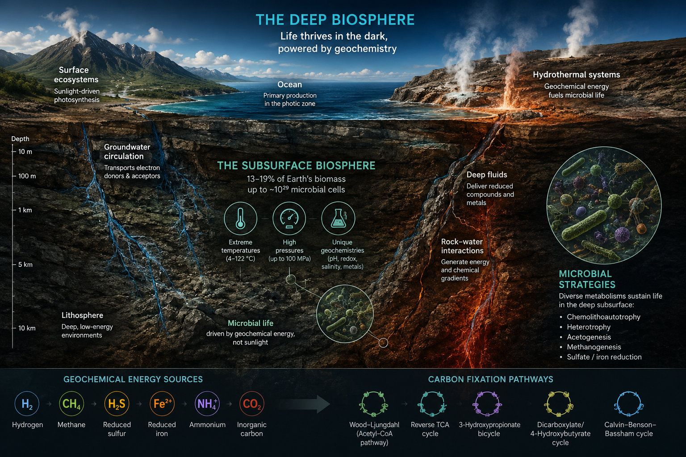
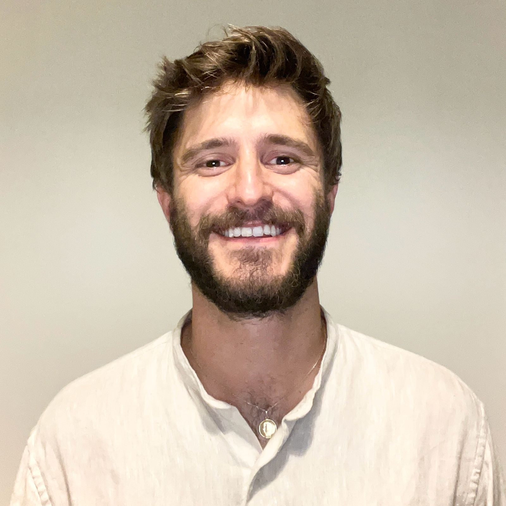
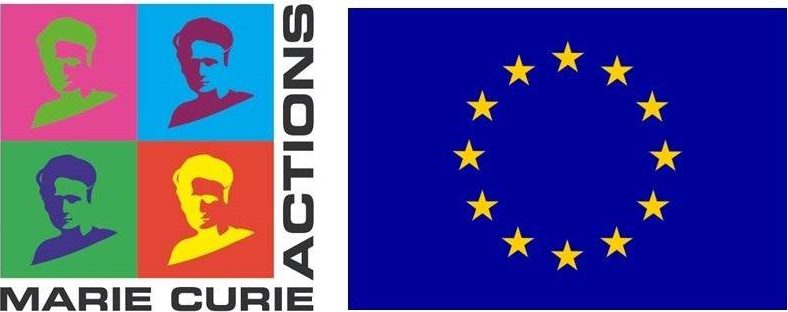

# Subsurface Carbon Fixation Across Earth’s Hidden Biosphere: The MCSA Subcarb project

> *How do microorganisms shape the flow of carbon through the deep Earth?*

SUBCARB is a Marie Skłodowska-Curie Postdoctoral Fellowship hosted at the [Giovannelli Lab](https://giovannellilab.github.io) at the University of Naples Federico II and led by [Benoît de Pins](https://it.linkedin.com/in/benoit-de-pins-2b4433156).

The project investigates how microorganisms living in Earth’s subsurface convert inorganic carbon into biomass under extreme conditions of temperature, pressure, redox chemistry, and metal availability.

SUBCARB combines environmental microbiology, biochemistry, isotope geochemistry, metagenomics, metaproteomics, and computational modeling to build a predictive framework for subsurface carbon fixation across diverse geological environments.

---

## Why the Deep Subsurface Matters

The subsurface biosphere contains a substantial fraction of Earth’s microbial biomass and hosts ecosystems fundamentally different from those at the surface.

Unlike surface ecosystems powered by sunlight and oxygenic photosynthesis, deep ecosystems rely on chemical disequilibria generated by geology itself. Hydrogen, reduced sulfur compounds, methane, iron, and carbon dioxide become the energetic currencies of life underground.

In these environments, microorganisms use multiple carbon fixation pathways beyond the canonical Calvin cycle. Ancient pathways such as the Wood–Ljungdahl pathway and the reverse TCA cycle may dominate in reducing environments and resemble some of the earliest metabolisms in Earth history.

SUBCARB asks three central questions:

- Which carbon fixation pathways dominate in different subsurface environments?
- How do environmental parameters regulate microbial carbon assimilation?
- Can we predict subsurface carbon fixation from geological and geochemical data?

These questions are relevant not only to microbiology and Earth system science, but also to:
- carbon capture and storage (CCS),
- natural and engineered hydrogen systems,
- geomicrobiology,
- biotechnology,
- and the search for life beyond Earth.

  

---

## Scientific Vision

SUBCARB moves beyond taxonomy-focused descriptions of the subsurface biosphere toward a quantitative, metabolism-centered understanding of microbial carbon cycling.

The project integrates:

- Global-scale metagenomic and metaproteomic surveys
- Environmental geochemistry
- Stable isotope measurements
- Controlled cultivation experiments

The long-term goal is to understand the deep biosphere as an active planetary process rather than a passive microbial reservoir.

---

## Latest Results

### The Subsurface Biosphere Is Functionally Distinct from Surface Ecosystems

Our latest preprint explores carbon fixation across hundreds of deeply sourced subsurface systems and compares them with more than 1500 surface-associated environments.

#### Latest Preprint
**Biological overprint on geological carbon cycling in the subsurface**  
[https://www.biorxiv.org/content/10.64898/2026.05.06.723307v1](https://www.biorxiv.org/content/10.64898/2026.05.06.723307v1)

Key findings include:

- Subsurface environments exhibit greater physicochemical and geochemical diversity than surface ecosystems.
- Carbon fixation strategies differ profoundly between surface and subsurface microbiomes.
- Deep ecosystems are enriched in non-canonical autotrophic pathways linked to reducing conditions and geological energy sources.
- Functional organization of subsurface microbial communities is more modular and environmentally structured.
- Geological parameters such as temperature, helium signatures, and redox-sensitive trace metals correlate with metabolic organization.
- We estimate the global continental subsurface carbon fixation rate to be ∼2.65 Pg C yr−1 (range: 0.31–2.99). This represents ∼2% of terrestrial photosynthetic primary production, and is 10x geological fluxes between the surface and the subsurface. 

Together, these observations suggest that the deep biosphere is not simply a diluted extension of surface life. It represents a distinct metabolic domain shaped by planetary geochemistry.

---

## From Rubisco Evolution to Planetary Metabolism

Before SUBCARB, Benoît worked on the global diversity and evolution of Rubisco, the most abundant carbon-fixing enzyme on Earth.

### Previous Work
**Global diversity and environmental structuring of Rubisco enzymes**  
[https://www.biorxiv.org/content/10.1101/2023.09.27.559826v2](https://www.biorxiv.org/content/10.1101/2023.09.27.559826v2)

This work systematically explored genomic and metagenomic datasets to understand how environmental constraints shape Rubisco evolution across Earth’s ecosystems.

SUBCARB extends this trajectory from:
- enzyme evolution,
- to metabolic systems,
- to ecosystem-scale carbon fixation,
- to planetary-scale biogeochemical processes.

The common thread is understanding how life adapts carbon assimilation to changing planetary conditions.

---

## About Benoît de Pins

  

Benoît de Pins is a Marie Skłodowska-Curie Postdoctoral Fellow working at the interface between:
- biochemistry,
- microbial ecology,
- Earth system science,
- and planetary evolution.

His research focuses on how microorganisms adapt carbon fixation strategies to diverse environmental constraints, from enzymes to ecosystems.

Before joining the Giovannelli Lab, he worked on the evolution and diversity of Rubisco and microbial autotrophy through large-scale genomic and experimental approaches. His background combines:
- neurobiochemistry,
- systems biology,
- metabolic engineering,
- and environmental microbiology.

His current work explores how subsurface microbial metabolisms influence global carbon cycling and how life interacts with geological processes across Earth’s hidden biosphere.

### External Profiles

- LinkedIn: https://it.linkedin.com/in/benoit-de-pins-2b4433156
- Fondation Bettencourt Schueller: https://www.fondationbs.org/en/our-community/laureates-and-projects/benoit-de-pins

---

## Publications

My publications can be found here [https://scholar.google.com/citations?user=26mBnWQdo90C&hl=en&oi=ao](https://scholar.google.com/citations?user=26mBnWQdo90C&hl=en&oi=ao)

---

## News

### New preprint released

Our latest study on subsurface carbon fixation and biological overprint on geological processes is now available on bioRxiv.

[https://www.biorxiv.org/content/10.64898/2026.05.06.723307v1](https://www.biorxiv.org/content/10.64898/2026.05.06.723307v1)

---

### International conferences

Results from SUBCARB were presented at international meetings in geomicrobiology, Earth system science, and microbial ecology:

- 

---

## Open Science

SUBCARB follows FAIR and open-science principles.

The project aims to make:
- metagenomic datasets,
- metadata,
- analytical pipelines,
- and computational tools

openly available to the scientific community.

---

## Acknowledgments

SUBCARB is funded by the European Union thorugh a Marie Skłodowska-Curie Actions Postdoctoral Fellowship (Grant Agreement No. 101154017; HORIZON-MSCA-2023-PF-01 project SUBCARB) under the European Union’s Horizon Europe programme, and hosted at the Department of Biology of the University of Naples Federico II.

  

### Host Institution
[https://www.biologia.unina.it](https://www.biologia.unina.it)

### Research Group
[https://www.donatogiovannelli.com](https://www.donatogiovannelli.com)
